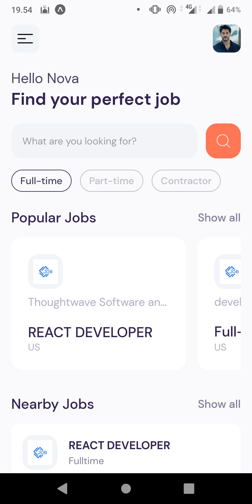
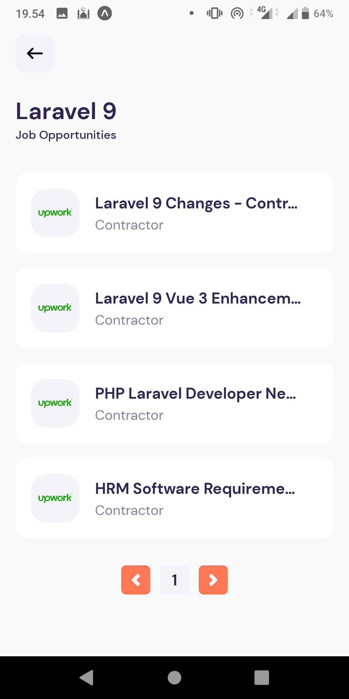
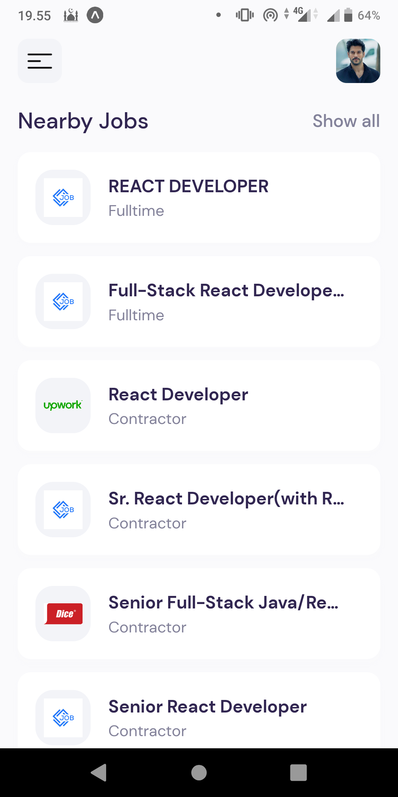
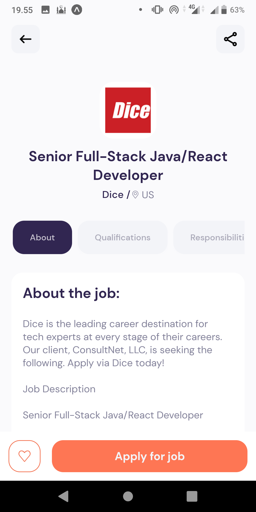
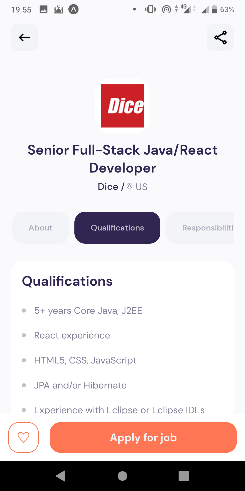
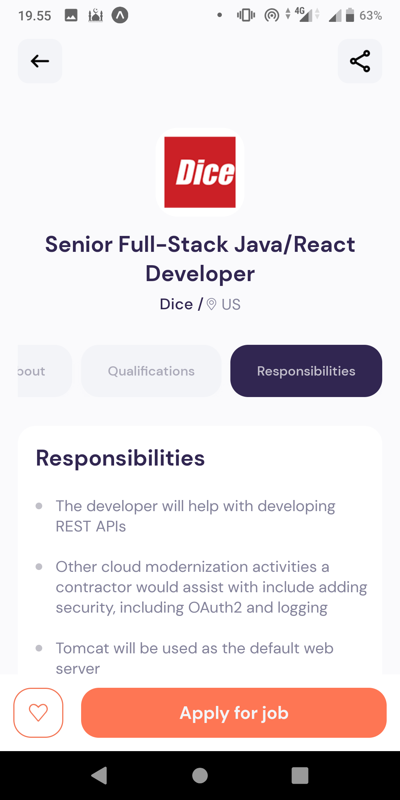

# Career Hunt - Find your dream job

Hi Future Developer!

Welcome to our exciting project that revolves around simplifying the process of building mobile applications using popular technologies like React Native and Expo.

The application I'm developing is a simple app designed to help you find your dream job. It's built using React Native and Expo, and it fetches data from the "Jobs Search" API provided by RapidAPI. You can get the API key for free by visiting the RapidAPI website and searching for the API mentioned.

Currently, I'm working on several features for the app, including:
- [x] Displaying a list of popular jobs based on keywords
- [x] Showing a list of nearby jobs based on location
- [x] Presenting a filtered list of jobs based on user preferences
- [x] Providing detailed job information, such as company details, location, and job description

There are more features in the pipeline for this app. If you're interested in contributing, feel free to fork this repository and submit a pull request. Don't forget to star the repository if you like the app.

Thank you for your interest. Happy coding!

## Environment

- [React Native](https://reactnative.dev/)
- [Expo](https://expo.dev/)
- [JSearch API](https://jsearch.io/api)

## Contributing

Hey, future Developer! Come join our awesome project. We welcome your ideas, critiques, suggestions, and pull requests. Show some love with a ⭐ and consider donating to fuel the app's growth! 🚀

## License

Guess what? This project dances to the beat of the [MIT License](https://github.com/novaardiansyah/CareerHunt/blob/main/LICENSE)! 🎉

## Contact

Feel free to reach out to me via [Email](mailto:novaardiansyah78@gmail.com) or [Whatsapp](https://wa.me/6289506668480?text=Hi%20Nova,%20I%20have%20a%20question%20about%20Career%20Hunt). I'm just a message away! 📩

## Preview

  
  

  
  

  
  

## Status 

